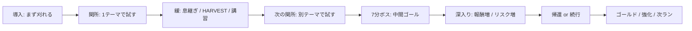

# PACING_V2 — 難易度調整AI作り直し(方向転換フォーク)設計書 — Sonnet実装用

社長決定(v0.26.0フォーク直後・設計チャットFable経由)。**このブランチ(`claude/direction-shift`)の
進行プロジェクトは本書。** PACING_REDESIGN.md(旧線の仕様)は前提知識として残るが、台本選択と
時間骨格は本書が上書きする。矛盾したら本書が勝つ。

## 運用(2チャット体制・従来どおり)
- 実装チャット(Sonnet): 本書のバッチをR1→R5の順に実装。結果はDEVELOPMENT_LOG.mdと本書の
  ステータス更新で残す。**設計判断はしない**(未決に当たったら本書★未決事項に書いて止まる)。
- 設計チャット(Fable): 社長との会議。決定は本書を直接更新。
- **テスト方針(社長指示・v0.26.6)**: この線は**R1〜R4を一気に実装してから統合テスト1回**で
  判定する。バッチごとの実機確認は行わない(静的検証+ユニットテストは毎バッチ従来どおり)。
  R4完了時点で「統合テスト待ち」として社長へ報告する。
- 毎push: version bump(このブランチは**0.26.x**)+ lint/typecheck/test/build 全通過 +
  DEVELOPMENT_LOG追記(憲法4条/5条の自己点検1行つき)。

## 0. 社長決定の設計図(原文の骨格・v0.26.1採録)
目的は「敵を強くする」ではなく、1ランの中で **静かな時間 → 試される時間 → 気持ちよく刈る時間 →
報酬を持ち帰る判断** を順番に感じさせること。

重要ポイント(社長原文の要旨・全バッチが従う):
1. **台本は難易度ではなく多様性で回す**。rank寄せ廃止。台本選択=未見優先/直前禁止/時間解禁。
   Rankはpressure開始値・ホード規模・報酬倍率にだけ使う。
2. **60秒単位で呼吸を作る**。導入60秒→以後基本 関所60秒⇄緩60秒。
3. **関所は毎回テーマを1つ立てる**。詰め込み禁止(混ぜると「ただごちゃごちゃ」)。
4. **安全弁は残す**(zone天井/pressure/boardDebt/pity)。ただし役割は「台本を選ぶ」ではなく
   「出し方を安全にする」。**台本は見せる。危険度は状況で抑える。**
5. **浅いエリアでも“違い”は見せる**。初心者ゾーンの問題児禁止(憲法4条)は維持しつつ、
   湧き方向・チャフ配合・バナー・イベント形でテーマを感じさせる。
6. **緩は本当に緩にする**。純休憩/HARVEST/講習(1体)/回収のどれか。硬いゾンビ・問題児を常駐させない。
7. **7分を中間ゴールにする**。以降の深入りは報酬も危険も増える別モード。
8. **③ランのループを閉じる**(ゴールド経済接続=R5)。

対応する構造問題(PACING_REDESIGN.md★乖離洗い出しP1〜P8): P1(保証原則→R1-D)/P2(浅エリア表現→R4-C)/
P3(τ・ホールド→R1-E)/P4(確定供給→R1-D)/P5(多様性ローテ→R1)/P6(シミュ検証→R1受け入れ条件)/
P7(経済→R5)/P8(一括改訂=本書)。

## 1. 不変条件(全バッチ共通)
- **憲法は全条維持**(基本10体/問題児キャップ/テンポ第一/初心者ゾーン不可侵)。
  `constitution.test.ts` は常に通す。本書が要求する変更でテストの前提が変わる箇所は
  各バッチに明記してある(それ以外の緩和は★未決事項へ)。
- 数値は**全て叩き台(実機調整前提)**。ただしSonnetが勝手に変えるのは禁止(従来どおり)。
- シミュレーション層(src/store/src/utils/src/world)のレンダラ非依存を維持。
- 復帰フラグ: **`?v2=0` で R1+R2 をまとめて旧挙動(rank寄せ選択+旧PHASES)へ戻せる**こと。
  旧コードパスは実機確認が通るまで削除しない。

---

## バッチR1: 台本ローテーション(rank寄せ廃止)【最初に実装】

### R1-A. 時間解禁テーブル(旧: phaseMaxRungフィルタの置き換え)
`gateProgram.ts` の各台本に `unlockMs` を追加し、適格判定を
`p.maxRung <= phaseMaxRung` から **`gameTime >= p.unlockMs`** に置き換える。
| 台本 | unlockMs(叩き台) |
|---|---|
| 数 gate-number | 0:00 |
| 射線 gate-lineofsight | 0:00 |
| 判断 gate-judgment | 2:00 |
| 襲撃 gate-assault | 3:00 |
| 三択 gate-triple | 4:00 |
| スパイク gate-boss-spike | 4:00 |
| 不意打ち gate-ambush | 7:00(深入り専用) |
台本自身の `maxRung`(→`ceilingForMaxRung`でpressure天井)は**維持**(安全弁・重要ポイント4)。

### R1-B. 未見優先シャッフル+直前禁止
`selectGateProgram` を書き換え:
1. 適格 = unlockMs通過 ∧ イベント関所選出ルール(a)(b)(c)は**従来どおり維持**
   (gateIndex≥2/イベント連続禁止/pityブロック=安全弁)。
2. `lastProgramId` は除外(pool>1のとき。従来どおり)。
3. **このランで未見**(`seenProgramIds: Set<GateProgramId>` を新設・ラン開始でリセット)の台本が
   poolにあれば未見だけに絞る。
4. 残りから `tieBreakRandom` で**一様に**選ぶ(maxRungソートとrank分岐は削除)。
- Rankの残る用途: `startPressure`(pressure開始値)・ホード規模・報酬倍率のみ。台本選択から完全撤去。

### R1-C. Rank入力の撤去
`GateProgramInput` から `rank` を外し、`gameTime` と `seenProgramIds` を追加。呼び出し側
(useGameLoop)の配線も更新。判断の関所の `style` / `tieBreakRandom` は従来どおり。

### R1-D. 主題保証(guarantee)— 「台本は見せる」の実装
関所ごとに: 関所開始から**15秒**(叩き台 `GATE_FEATURE_GUARANTEE_MS=15000`)経過時点で、
その台本の featured 問題児が**このランの当該関所内で1体も出現していない**なら、
pressureしきい値・boardDebtゲート・Intensityを**無視して1体を確定投入**する。
- **破ってよい**: pressureしきい値 / boardDebt投入ゲート / Intensityホールド。
- **破ってはならない**: ゾーン天井(憲法4条・初心者ゾーンでは確定投入しない→R4-Cの代替表現)/
  同時数キャップ(憲法2条)/ リフラクトリ15秒。キャップ満杯なら空き待ちで投入(関所内で消化)。
- イベント関所(襲撃/スパイク)はイベント自体が主題なので対象外(既存のイベント発火が保証)。
- 計測: `recordSpawn` 済みの型別集計を関所開始時に `snapshotSpawns()` でアンカーして判定
  (**ディープコピー必須** — 実装精度の規律3)。

### R1-E. pressureの登り調整(P3対応)
- 上げτ **8秒→5秒**(`gatePressure.ts`。60秒関所内に配役0.50へ確実に届かせる)。
- **Intensity≥0.75の上げ停止(ホールド)を撤廃**。危険時の抑制は被弾インパルス(−0.15・維持)+
  boardDebt+キャップが担う(重要ポイント4「台本は見せる。危険度は状況で抑える」)。
  ※gatePressure.test.tsのホールド系テストは仕様変更として書き換えてよい(本書が裁定)。

### R1受け入れ条件
- 純関数シミュテスト(新規 `gateRotation.test.ts`): 100ラン×関所列を回して
  (i)直前台本が連続0回 (ii)未見が残る限り未見が選ばれる (iii)unlockMs前の台本が選ばれない
  (iv)十分な関所数で全メニューが出現する、を統計でなく**全数**検証。
- guarantee: ユニットテストで「15秒経過・未出現→投入指示が立つ」「ゾーン0-1では立たない」
  「キャップ満杯では待つ」を検証。
- `constitution.test.ts` 通過(featured自己整合テストはmaxRung天井基準のまま=変更不要)。
- `?v2=0` で旧選択ロジックに戻ることを確認。

---

## バッチR2: 時間骨格の60秒化(PHASES再カット)

`difficultyDirector.ts` の `PHASES` を以下へ再カット(countCapは憲法1条内・従来値踏襲):
| 時刻 | kind | countCap | 備考 |
|---|---|---|---|
| 0:00-1:00 | buildup(導入) | 8 | SCENE_RELIEF_SPARSE(まず刈れる) |
| 1:00-2:00 | gate① | 10 | シーンは台本ローテが差し替え |
| 2:00-3:00 | buildup② | 9 | 緩(演目はreliefProgramが選択) |
| 3:00-4:00 | gate② | 10 | |
| 4:00-5:00 | buildup③ | 9 | |
| 5:00-6:00 | gate③ | 10 | |
| 6:00-7:00 | buildup④ | 9 | ボス前の整え |
| 7:00-7:30 | boss(城ボス) | 10 | 中間ゴール(離脱=クリア可・従来どおり) |
| 7:30-8:30 | buildup⑤(立て直し) | 9 | **ここから深入りモード** |
| 8:30-9:30 | gate④ | 10 | 以後 関所60⇄緩60 を継続 |
| …(60秒交互を継続) | | | 交互を**無限に継続**(終局の特別コマなし・【裁定済みv0.26.6】参照) |
- **深入りモード(7:30以降)**: 報酬増=rareMult/ゴールド系倍率へ深入り係数(叩き台×1.5)、
  リスク増=stageAggro・Rank由来のホード規模は従来どおり効かせる。不意打ち(ambush)が解禁される。
- PHASESの`maxRung`列は**撤去**(台本選択に使わなくなるため)。pressure天井=台本自身のmaxRung×
  ゾーン天井のみになる。`ceilingForZone`(憲法4条)は不変。
- 固定シーン(SCENE_GATE_CHAOS等)はgateスロットから消える(ローテが毎回差し替える)。
  MOWDOWN/講習系は緩の演目選択(R4)側に残る。
- `?v2=0` は旧PHASES定数へ切り替え(旧定数は残す)。

### R2受け入れ条件
- `difficultyDirector.test.ts` を新骨格に更新(境界時刻・countCap・boss位置7:00)。
- 憲法テスト通過(第1条countCap≤10)。
- 実機で: 導入60秒は静か/1:00に最初の関所が来る/7:00にボス。

---

## バッチR3: 関所テーマの可視化

- 関所開始時に**台本名バナー**を表示: 「数の関所」「射線の関所」「判断の関所」「襲撃」「三択」
  「スパイク」「不意打ち」。既存のイベント告知バナーの仕組みを流用(新規per-frame UI禁止)。
- `?director=1` のオーバーレイと診断グラフ(DirectorSample)に現在台本idを追加。
- **React再レンダ規律厳守**: バナーはフェーズ切替イベントでのみ更新(毎フレーム購読禁止)。
- 負荷スコア目安: 2/10(イベント時のみのDOM更新+診断1フィールド)。超えるなら止めて相談。

### R3受け入れ条件
- 実機で関所ごとにバナーが出て、台本の切り替わりが目で分かる。
- PerfOverlayのFPSが導入時と同等(バナー起因の毎フレーム再レンダなし)。

---

## バッチR4: 緩フェーズ整理+浅エリアのテーマ表現

### R4-A. 緩の演目ローテ
`selectReliefProgram` に未見優先/直前禁止を追加。ただし**条件付き演目が優先**:
1. 回収: 「出現したのに倒せなかった型」がある時だけ適格(既存判定を維持)。
2. 講習: 未経験の問題児型がある時だけ適格(主役1体・既存仕様を維持)。
3. どちらも不適格なら 純休憩⇄HARVEST を交互(直前禁止)。導入直後の緩=純休憩固定(既存)、
   7:00以降のHARVEST既定は**深入りの立て直しコマ(7:30-8:30)のみ純休憩**に置き換え、以降は既存どおり。

### R4-B. 緩の純度ガード
- 緩コマ中は問題児の新規投入経路を featuredFloor(講習/回収の主役)だけに限定
  (pressure配役・イベントは緩コマで発火しない=既存挙動の明文化+漏れ穴の確認)。
- 緩のchaffMixがbat中心(RELAX)である既存仕様を維持。「群れに1体」のゾンビ枠を超えて
  硬いゾンビが常駐しないことをテストで固定。

### R4-C. 浅いエリアのテーマ表現(P2対応・憲法4条は不変)【v0.26.6 定量化済み】
初心者ゾーン(エリア0-1)に居てfeatured問題児を出せない関所では、**代替表現**でテーマを見せる。

**共通ルール(全パターン)**
- 発動条件: gateコマ中 ∧ **コマ開始時点**のプレイヤーが初心者ゾーン(エリア0-1)。コマ開始時に
  1回判定して固定(コマ途中のゾーン移動では切り替えない)。深いエリアでは発動しない
  (そこはR1-Dの主題保証が担う)。
- 湧かせるのは**チャフ3種のみ**(型は当該台本の既存mixで選ぶ。問題児は型レベルで不可=
  SpawnDirectiveの型をチャフに限定する)。
- **countCap内**: 各投入時点で `現在数+投入数 ≤ dirCountCap` に収まる分だけ湧かせ、超過分は
  切り捨て(繰り越さない)。イベント扱いのcap外投入はしない。
- 配置の座標式(既存基準の踏襲・新しい境界判定を作らない):
  - 辺指定型 = 既存 `generateEnemy` の spawnSide 指定(固定ビュー矩形+`OFFSCREEN_SPAWN_MARGIN`)。
  - 角度指定型 = `spawnEnemyAt` へ、中心=プレイヤー中心・距離
    **`Math.hypot(gameBounds.width/2, gameBounds.height/2) + OFFSCREEN_SPAWN_MARGIN`**
    (reaperの`offScreenDist`と同式)で角度から座標算出。
  - 既存スポーンと同じ距離基準なのでズーム引きの新規リスクなし(念のため`?zoomlock=1`で1回確認)。
- 負荷スコア: **2/10**(増えるのは敵スプライトのみ=E60安全圏内。計算は発火時のみ・per-frame処理なし)。
- 復帰フラグ: **`?shallow=0`** でR4-C全体を無効化(発動条件を常にfalse)。

**台本別パターン(叩き台・時刻は全てコマ開始からの相対)**
| 台本 | kind | スケジュール・数値 |
|---|---|---|
| 数 | tempo | 追加配置なし。コマ中の湧きintervalMult**×0.7**(≒テンポ1.4倍)+mixをbat寄せ**{bat50/skeleton30/zombie20}**に上書き |
| 射線 | ring | +5sと+30sの2回。各回**8体**を**45°間隔**の円配置(開始角ランダム) |
| 判断 | pincer | +5s/+20s/+35s/+50sの4回。各回: ランダム軸角θと**θ+180°**(各±15°ゆらぎ)の2方向から**各3体**(計6体/回) |
| 襲撃 | ring | +10sの1回。**10体**を**36°間隔**の円配置(小囲い) |
| 三択 | waves | +5s/+25s/+45sの3波。各波**6体**を1方向±30°の扇状から。方向は波ごとに**120°ずつ回転**(初期角ランダム) |
| スパイク | burst | +10sの1回。1方向±20°から**10体**を2秒かけて投入(5体/秒) |
- 実装形: **新しい湧きシステムは作らない**。`src/utils/shallowExpression.ts`(新規・純関数)に
  ①`ShallowExpression`型(上表のkind+パラメータ。gateProgramへ`shallowExpression`として付与)
  ②スケジューラ `dueShallowSpawns(expr, gateStartMs, prevMs, nowMs)` → `SpawnDirective[]`
  (発火判定は prevMs<発火時刻≤nowMs で1回ずつ)
  ③配置 `ringPositions(center, dist, count, startAngleRad)` 等の座標純関数、を置く。
  useGameLoopは受け取ったdirectiveを既存`generateEnemy`/`spawnEnemyAt`へ流すだけ(配線最小)。
- バナー(R3)は浅エリアでも同じ台本名を出す(=違いが名前と湧き方で分かる)。

### R4受け入れ条件
- 純関数テスト(`shallowExpression.test.ts`): 各kindの発火時刻・回数・体数が表どおり/
  同一発火が二重に出ない(prev/nowの境界)/ringPositionsの等間隔・等距離/
  SpawnDirectiveの型がチャフ3種に限られる。
- 初心者ゾーン滞在プレイでも関所ごとに湧き方の違いが目視で分かる(実機確認項目・統合テスト時)。
- 憲法テスト通過(初心者ゾーンに問題児が出ないこと=既存テストが守る)。
- 緩コマ中に問題児がfeaturedFloor経由以外で湧かないユニットテスト。
- `?shallow=0`で発動しないこと。

---

## バッチR5: ゴールド経済の接続【価格の社長採否が前提・着手前に確認】

- 前提: CORE_LOOP.md §6 の価格叩き台(ガチャ100g/天井14=1400g・サブ恒久解禁 基本200g/
  フィーチャー400g・キャラ固有サブ無料)の**社長採否待ち**。採用の連絡が本書ステータスに
  書かれるまで着手しない。
- 内容(採用後): unlockedShopSkillCardsのメタ永続化・価格表の実装・ショップUI接続・
  深入り係数(R2)を含む獲得ゴールドの実測ログ。詳細はCORE_LOOP.md§6。

---

## 実装順とステータス
| バッチ | 内容 | 状態 |
|---|---|---|
| R1 | 台本ローテ(時間解禁/未見優先/rank廃止/主題保証/τ5s・ホールド撤廃) | **完了(v0.26.3)** |
| R2 | 時間骨格60秒化(PHASES再カット・深入りモード) | **完了(v0.26.4)** |
| R3 | 関所テーマ可視化(バナー+診断) | **完了(v0.26.5)** |
| R4 | 緩整理+浅エリア代替表現 | 未着手(**R4-C定量化済みv0.26.6**・着手可) |
| — | 裁定2件の反映(τ再較正 / 交互無限継続) | R4と同時に実装(上記【裁定済み】参照) |
| R5 | ゴールド経済接続 | **社長採否待ち・着手禁止** |

## ★未決事項(Sonnetはここに書いて止まる)
(現在なし — 以下2件はv0.26.6で裁定済み。実装指示は各節の【裁定】を参照)

## 裁定済み(経緯の記録)

### 【裁定済みv0.26.6】R1-E τ短縮がstageAggro経由では実プレイに反映されない
**裁定: `stageAggro.ts`の`riseTauSForAggro`を `7 - 4*clamp01(aggro)` へ再較正する。**
(aggro=0→7s / 0.5(中立)→5s / 1→3s。スプレッド±2sは従来のまま、中立点だけをR1-Eの意図
どおり5sへ移す。)stageAggroによるτ変調はこの線では維持する(安全弁の一部)。
関連テスト(`stageAggro.test.ts`)は新式に更新してよい。
※参考: 旧線M1はstageAggro変調ごと省略してフラット5s。両線とも中立5sで統制条件は保たれる。
(発見の経緯は下記=Sonnetの報告どおり。良い止まり方だった)

#### (経緯)R1-E τ短縮(8s→5s)がstageAggro経由では実プレイに反映されない(v0.26.3発見)
- 症状: `gatePressure.ts`の`UP_TAU_S`は8→5に変更した(指示どおり)。しかし`useGameLoop.ts`は
  `stepGatePressure`へ`riseTauS: riseTauSForAggro(currentStageAggro())`を**常に**渡しており
  (`?stageaggro=0`時もcurrentStageAggro()が中立値0.5を返すだけで、riseTauS自体は省略されない)、
  `stepGatePressure`内は`inputs.riseTauS ?? UP_TAU_S`なので実プレイでは常にriseTauSForAggro側の
  値が使われ、UP_TAU_S定数は事実上のデッドコードになっている(純粋関数の単体テスト/デフォルト
  引数としてのみ生きる)。
- `stageAggro.ts`の`riseTauSForAggro(aggro) = 10 - 4*clamp01(aggro)`はaggro=0.5(既定/中立)で8sを
  返す式(バッチ6導入時にUP_TAU_S=8sへ一致するよう校正済み)。この式自体は本書のR1-Eの指示文
  (「gatePressure.ts」とだけ書かれている)に含まれていないため、Sonnetの判断では変更していない。
- 結果: 現状のコードのままだと「上げτ8→5秒」は**実プレイのどのURLフラグ設定でも体感に反映されない**
  (テストが検証するのは`stepGatePressure`という純粋関数の既定値としての5sのみ)。
- 裁定が必要な点: `riseTauSForAggro`の式もこの機会に再較正する(例: aggro=0.5で5sになるよう
  `7 - 4*clamp01(aggro)`等へ変更)か、あるいはUP_TAU_S変更は「純関数のデフォルト値としての意味合い
  のみで良く、実プレイの数値はstageAggro側の値付けを別途見直すまで現状維持でよい」のか。
  値・カーブの意味に関わるため実装チャットの判断では変更していません(仕様変更のルール)。

### 【裁定済みv0.26.6】R2 深入りモードの無限延長コマがbuildup(緩)になる
**裁定: 「最終コマの無限延長」は撤回(設計チャットの誤記)。14:00の特別扱いは廃止し、
関所60秒⇄緩60秒の交互を7:30以降**そのまま無限に継続**する。** 台本ローテも無限に回り続ける
(gate限定のgatePressure/主題保証はgateコマのたびに発火する=旧終局の「継続高強度」の代替は
交互リズムの高頻度gateが担う)。実装形(グリッドを式で返す等)はSonnetに任せる。
関連テストは交互の無限継続(例: 20:00台でもgate/buildupが正しく交互)を検証する形に更新。
(発見の経緯は下記=Sonnetの報告どおり)

#### (経緯)R2 深入りモードの無限延長コマがbuildup(緩)になる(v0.26.4発見・ブロッキングではないが記録)
- 本書R2は「7:30から60秒交互を継続し、14:00以降は最終コマを無限延長」とだけ指示している。7:30
  (`buildup⑤`開始)を起点に60秒刻みを機械的に継続すると、840000ms(14:00)は60秒グリッドの境界に
  乗らない(7:30+390000ms=14:00で、390000は60000の倍数ではない)。そのため「今進行中のコマを
  そのまま無限延長する」という文面どおりの実装をすると、無限延長コマは**buildup(緩)側**になる
  (`13:30`開始のbuildupがそのままInfinityへ延長される。旧PHASESの終局=gateとは種類が異なる)。
- ブロッキング扱いにしなかった理由: `reliefProgram.ts`の`late`分岐(7:00以降)は既定でHARVEST無双を
  返す(講習・純休憩は選ばれない。例外は成績最悪時のみ)ため、無限延長コマが`buildup`種であっても
  実際の中身は無双(高強度)寄りになり、「旧終局=継続高強度」の体感からは大きく外れないと判断した。
  ただし種別としては`gate`ではなくなる(gate限定のgatePressure/主題保証/台本ローテはこの無限コマ中は
  発火しない)。この判断で良いか、または14:00がグリッド境界に乗るよう7:30〜14:00間のどこかのコマを
  一度だけ短縮する調整を入れるべきかは値・仕様の裁定が必要なため、実装は「文面どおりの機械的解釈」に
  留め、裁定を仰ぐ。
